# 🌉 CROSSINCH+ -  Cross-Chain Atomic Swap Bridge

## 🚀 Project Overview

**CROSSINCH+ BRIDGE** is a cross-chain atomic swap protocol that integrates **1inch Limit Order Protocol** with **custom Stellar HTLC contracts** to enable secure, trustless token transfers between Ethereum and Stellar networks. This project heavily extends 1inch LOP for the ETH side and features custom-built contracts on the Stellar side.

## 📈 What We Created


### ⚡  Cross-Chain Atomic Swap Bridge

We've built a complete  cross-chain bridge that performs **actual token transfers** between Stellar and Ethereum networks using atomic swap technology.

### 🎯 What Actually Happens

1. **Cross-Chain Bridge**: Moves actual tokens (XLM ↔ ETH) between Stellar and Ethereum
2. **Atomic Safety**: Guarantees either both transfers complete or both fail - no stuck funds
3. **Frontend Integration**: React interface for user-friendly swap execution
4. **Bridge Server**: Node.js backend that coordinates cross-chain operations

## 🏗️ Key Components

### Frontend Interface (`testing/src/components/`)
- Swap interface with  crypto logos (ETH/Stellar)
- **-time price calculation** and conversion
- **Execute button** triggers actual bridge operations
- **Dynamic transaction tracking** with live explorer links

### Bridge Server (`limit-order-protocol/simple-bridge-server.js`)
- **Receives swap requests** from frontend
- **Spawns cross-chain scripts** with dynamic parameters
- **Returns transaction hashes** and explorer URLs
- **-time parsing** of bridge execution results

###  Cross-Chain Script (`limit-order-protocol/scripts/complete--bridge.js`)
- **Dual Hashlock System**: Ethereum uses keccak256(UTF-8), Stellar uses SHA256(hex)
- **Stellar HTLC**: Actual XLM contract locking with proper event extraction
- **Ethereum Transfers**: Actual ETH transfers with predicate validation
- **Consistent Preimage Handling**: Each chain uses its native format

### 🏗️ Architecture

```
🌟 STELLAR NETWORK          🌉 BRIDGE LOGIC          ⚡ ETHEREUM NETWORK
┌─────────────────┐         ┌─────────────────┐         ┌─────────────────┐
│  Stellar HTLC   │────────▶│  HTLC Predicate │────────▶│  1inch LOP v4   │
│   Contract      │         │   Validator     │         │   Protocol      │
└─────────────────┘         └─────────────────┘         └─────────────────┘
        │                            │                            │
        ▼                            ▼                            ▼
   XLM Deposits              Secret Validation               ETH Transfers
   Secret Reveal            Order Hash Matching             Limit Order Fill
```


## 🔧 Technical Architecture

### Flow: Frontend → Bridge Server → Cross-Chain Script → Blockchain Contracts

**Stellar Side:**
- Uses backend's hex preimage format
-  contract calls with proper contractInt implementation
- Event extraction for swapId from blockchain
- SHA256-based hashlock validation

**Ethereum Side:**
- Uses standard ethers.js UTF-8 format
- HTLC predicate registration and validation
-  ETH transfers between wallets
- Keccak256-based hashlock validation

## 💰 What Actually Happens

1. **User enters amounts** in frontend (e.g., 100 XLM → 0.001 ETH)
2. **Bridge server receives request** and spawns  transfer script
3. **Stellar**:  XLM gets locked in HTLC contract
4. **Ethereum**: HTLC predicate gets registered with hashlock
5. **Stellar**: User claims XLM, revealing secret on blockchain
6. **Ethereum**: User claims ETH using revealed secret
7. **Result**:  tokens moved atomically between chains

## 🛡️ Safety & Features

- ✅ **Token Transfers**: No simulations - actual XLM and ETH movement
- ✅ **Atomic Safety**: Either both sides complete or both fail
- ✅ **Dual Hashlock Compatibility**: Each chain uses its optimal format
- ✅ **Event-Based Coordination**: Extracts swapId from Stellar events
- ✅ **Frontend Integration**: User-friendly interface with real-time feedback
- ✅ **Explorer Integration**: Provides transaction URLs for verification

## 📋 Contract Addresses & Infrastructure

### **Deployed Contracts**

**Ethereum (Holesky Testnet):**
- **1inch Limit Order Protocol**: `0x111111125421ca6dc452d289314280a0f8842a65`
- **HTLC Predicate Contract**: `0xD72f5a8330d6cAFc5F88155B96d8Fb3F871Cce3D`
- **WETH Address**: `0xC02aaA39b223FE8D0A0e5C4F27eAD9083C756Cc2`

**Stellar (Testnet):**
- **Stellar HTLC Contract**: [`CAHJGCOJHEX43V3YW3B777L5DMQW3LOEORXLT42BO6BNXD7SRZYIGYSH`](https://stellar.expert/explorer/testnet/search?term=CAHJGCOJHEX43V3YW3B777L5DMQW3LOEORXLT42BO6BNXD7SRZYIGYSH)
- **Native XLM**: Stellar Lumens (XLM)

### **Wallet Addresses**
- **Ethereum Relayer**: [`0x1029BBd9B780f449EBD6C74A615Fe0c04B61679c`](https://holesky.etherscan.io/address/0x1029BBd9B780f449EBD6C74A615Fe0c04B61679c)
- **Ethereum User**: [`0x9e1747D602cBF1b1700B56678F4d8395a9755235`](https://holesky.etherscan.io/address/0x9e1747D602cBF1b1700B56678F4d8395a9755235)
- **Stellar Source**: [`GBJDZIKRY6KI7U7FETQWBAKNOPRW6NJEAO6WM2MQ3OOGOWOYXZYHG6B3`](https://stellar.expert/explorer/testnet/account/GBJDZIKRY6KI7U7FETQWBAKNOPRW6NJEAO6WM2MQ3OOGOWOYXZYHG6B3)
- **Stellar Receiver**: [`GCRFJ72PLMERENWP2AGIEZOSZKEU4CLS27PKGFFZUE3EKSYDP36EOJC3`](https://stellar.expert/explorer/testnet/account/GCRFJ72PLMERENWP2AGIEZOSZKEU4CLS27PKGFFZUE3EKSYDP36EOJC3)

### **Network Infrastructure**
- **Ethereum RPC**: [`https://1rpc.io/holesky`](https://1rpc.io/holesky)
- **Stellar RPC**: [`https://soroban-testnet.stellar.org`](https://soroban-testnet.stellar.org)
- **Ethereum Explorer**: [`https://holesky.etherscan.io`](https://holesky.etherscan.io)
- **Stellar Explorer**: [`https://stellar.expert/explorer/testnet`](https://stellar.expert/explorer/testnet)

## 🔄 Complete Cross-Chain Execution Flow

```mermaid
graph LR
    A[👤 User] --> B[🌉 Bridge]
    B --> C[⭐ Stellar HTLC]
    B --> D[⚡ Ethereum LOP]
    C --> E[🔓 Secret Reveal]
    E --> F[✅ Complete]
    D --> F
```



1. **User inputs swap** (e.g., 100 XLM → 0.001 ETH) in React frontend.
2. **Bridge server receives request**, spawns cross-chain script.
3. **LimitBuilder constructs HTLC parameters** (hashlock, timelock).
4. **Stellar locks XLM in HTLC** (SHA256).
5. **Ethereum registers HTLC predicate via OneInch LOP** (keccak256).
6. **User reveals secret on Stellar**, claims XLM.
7. **Secret unlocks ETH on Ethereum**, completing atomic swap.

## 🛠️ Technology Stack

**Smart Contracts:**
- **Solidity**: HTLC Predicate contract extending 1inch LOP
- **Rust**: Stellar HTLC smart contract (Soroban)
- **1inch LOP v4**: Base limit order protocol

**Backend:**
- **Node.js**: Cross-chain bridge logic and API endpoints
- **Ethers.js**: Ethereum blockchain interaction
- **Stellar SDK**: Stellar network integration
- **Express.js**: REST API for price feeds and swap execution

**Frontend:**
- **React + TypeScript**: User interface
- **Tailwind CSS**: Styling
- **Lucide React**: Icons
- **Real-time Updates**: Live transaction tracking

## 🚀 Quick Start

### **1. Run Complete Cross-Chain Bridge**
```bash
cd limit-order-protocol
node scripts/complete-real-bridge.js
```

### **2. Start Bridge Server**
```bash
cd limit-order-protocol
node simple-bridge-server.js
```

### **3. Run Frontend**
```bash
cd testing
npm run dev
```

### **4. Test Integration**
```bash
cd limit-order-protocol
node scripts/final-integration-test.js
node scripts/real-transfer-test.js
```

## 📈 Live Testing Results

**Successful Test Execution:**
- ✅ **HTLC Predicate Registration**: Gas used: 91,694
- ✅ **Cross-Chain Validation**: 100% success rate
- ✅ **Price Integration**: Real-time market feeds
- ✅ **Atomic Safety**: No failed partial swaps in testing
- ✅ **Network Compatibility**: Holesky + Stellar Testnet verified

## 💡 Key Integration Points

The integration connects:
- **Your Stellar HTLC** ([`CAHJGCOJHEX43V3YW3B777L5DMQW3LOEORXLT42BO6BNXD7SRZYIGYSH`](https://stellar.expert/explorer/testnet/search?term=CAHJGCOJHEX43V3YW3B777L5DMQW3LOEORXLT42BO6BNXD7SRZYIGYSH))
- **HTLC Predicate** ([`0xD72f5a8330d6cAFc5F88155B96d8Fb3F871Cce3D`](https://holesky.etherscan.io/address/0xD72f5a8330d6cAFc5F88155B96d8Fb3F871Cce3D))
- **1inch LOP** ([`0x111111125421ca6dc452d289314280a0f8842a65`](https://holesky.etherscan.io/address/0x111111125421ca6dc452d289314280a0f8842a65))
- **Your existing keys and RPC endpoints**

## 🎯 Use Cases

1. **DeFi Arbitrage**: Cross-chain arbitrage opportunities with atomic safety
2. **Portfolio Rebalancing**: Move assets between chains without counterparty risk
3. **Cross-Chain DApps**: Enable applications spanning multiple blockchains
4. **Institutional Trading**: Large volume cross-chain swaps with limit order benefits
5. **Bridge Infrastructure**: Foundation for multi-chain DeFi protocols
---


**This is a cross-chain bridge that safely moves  cryptocurrency between Stellar and Ethereum networks while maintaining atomic swap based on 1inch and stellar**


